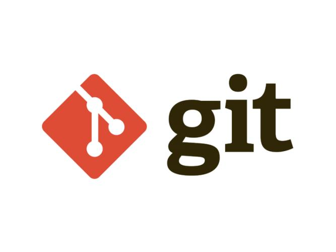
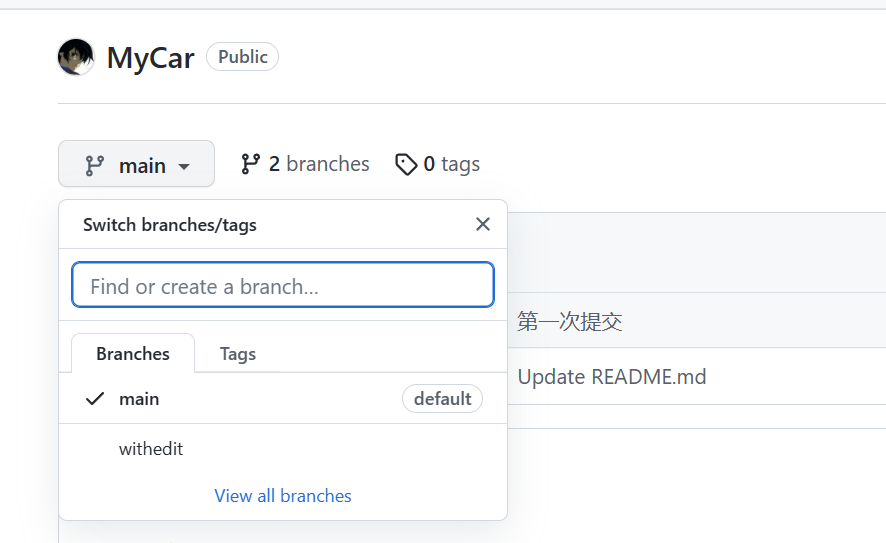
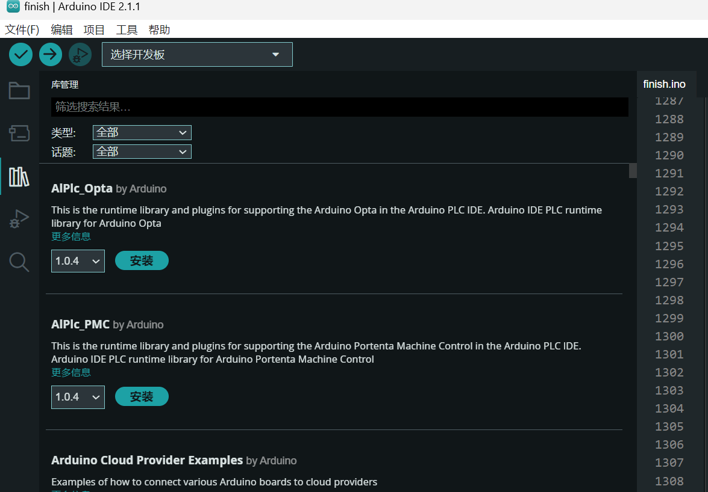
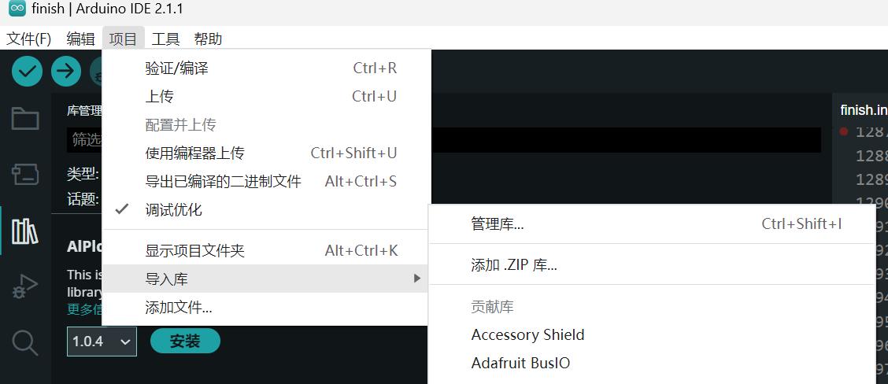
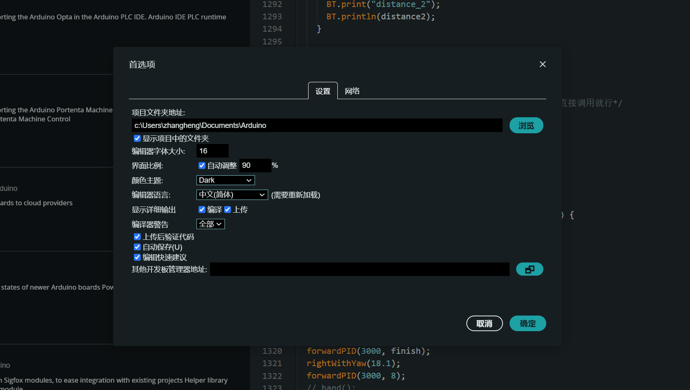

# 物流车的源代码
### 写在前边：真心希望咱们这个物流车项目能好好发展下去，每一届都有创新，新改进，不希望大家原模原样照抄。也是为了记录咱们这个项目，特别设了这个仓库，往后咱们物流车代码全放这里，希望往后的组长能好好管理，及时更新，包括写这个教程文档哈~~~ 


## 一、团队开发请看
####  1.学习如何使用git/github



团队开发，使用管理工具非常重要，git是工作必备的，github又是你寻找开源项目唯一的方式([尚硅谷新版Git快速入门(3h迅速掌握git)_哔哩哔哩_bilibili](https://www.bilibili.com/video/BV1wm4y1z7Dg/?spm_id_from=333.788.video.desc.click&vd_source=6718fb46dbdd603565f483b04b4cdb50))

#### 2.本仓库分支结构
main分支不要动，保存最开始源代码，其他分支（如withedit）请随便push，建议每个人建立自己的独立分支，自己的代码修改希望都push到github上，能够方便互相学习



下面是建仓库别名，记得先配置SHH，其他的指令视频教程里非常详细，仔细学会
```bash
 git remote add MyCar git@github.com:Aruoshui/MyCar.git
```

## 二、物流车项目基础
#### 1.Arduino开发
学习Arduino，进行相关实验，可以学习以下视频[【太极创客】零基础入门学用Arduino 第一部分 合辑](https://www.bilibili.com/video/BV164411J7GE/?spm_id_from=333.337.search-card.all.click&vd_source=6718fb46dbdd603565f483b04b4cdb50)

IDE可以使用官方的[点击下载](https://downloads.arduino.cc/arduino-ide/arduino-ide_2.2.1_Windows_64bit.exe?_gl=1*10xfh5t*_ga*MTEwMjMxMjMwMi4xNjk3MzY5ODI4*_ga_NEXN8H46L5*MTY5NzQ2NzQ1Ny4zLjEuMTY5NzQ2NzQ5MS4wLjAuMA..)然后往后就是傻瓜安装

你要是会折腾，可以在官方的基础上，[配置vscode来编写Arduino](https://zhuanlan.zhihu.com/p/589453733)，做版本控制，以及用其他更好的插件

#### 2.板子
##### Arduino板子：Arduino板子有各种各样的，比赛要求使用Arduino mega2560，我们也选择这个
##### 树莓派：可以更换底层控制板，跟Arduino基本相同，但是扩展性更好，当然也有嵌入式AI开发的，可以选择用来做路径规划，图像识别，目标检测，比赛没有具体要求，我们比赛也没有检查硬件，但是Arduino是必有的，树莓派可以做上位机，控制终端

#### 3.导包教程
新编辑器有三种方法
##### (1)使用IDE左侧扩展来安装包
跟VScode装插件一样

点击安装即可，就可能网速慢点，下的慢，点击详细信息能跳转包的官方介绍

##### (2)导入.ZIP包安装
第三方写好包之后，如果你下载了他的zip文件，可以以这种方式导入，也适用在github上下的包


##### (3)在项目文件夹中添加
首先找到你的编辑器安装位置，或者点击首选项，找到这个文件夹

在当前目录就能找到libraries文件，把包放这里解压也一样的

#### 4.通讯

#### 5.最主要的算法
##### (1)滤波算法
##### (2)PID控制算法
##### (3)MPU角度解算
##### (4)目标检测
##### (5)分类识别

## 三、本源代码介绍
#### 1.机械臂
#### 2.摄像头
#### 3.物流车控制相关
#### 4.路径规划和运动逻辑


